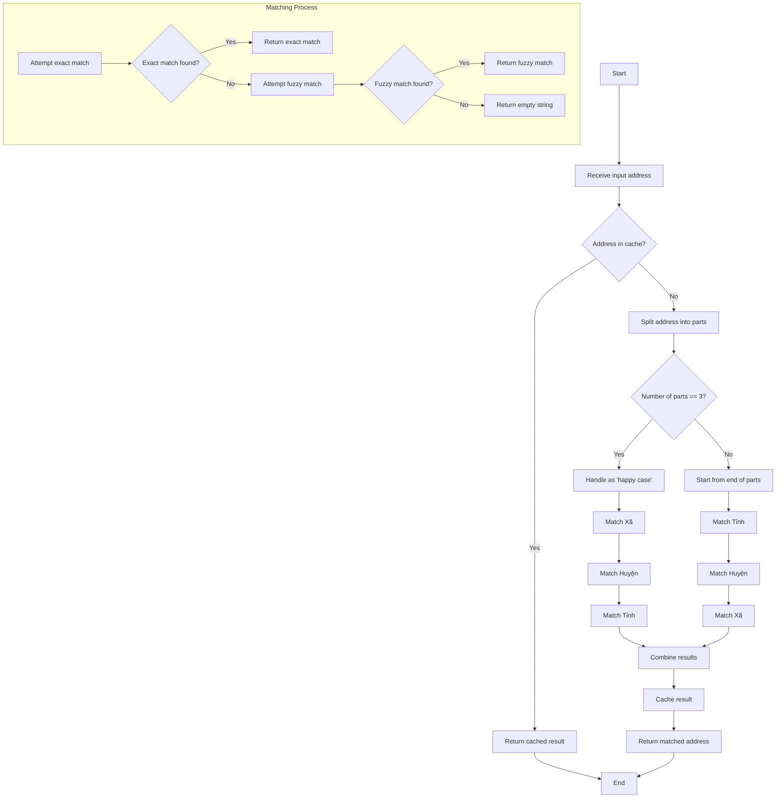

```mermaid
graph TD
    A[Start] --> B[Receive input address]
    B --> C{Address in cache?}
    C -->|Yes| D[Return cached result]
    C -->|No| E[Split address into parts]
    E --> F{Number of parts == 3?}
    F -->|Yes| G[Handle as 'happy case']
    F -->|No| H[Start from end of parts]
    
    G --> I[Match Xã]
    I --> J[Match Huyện]
    J --> K[Match Tỉnh]
    
    H --> L[Match Tỉnh]
    L --> M[Match Huyện]
    M --> N[Match Xã]
    
    K --> O[Combine results]
    N --> O
    
    O --> P[Cache result]
    P --> Q[Return matched address]
    D --> R[End]
    Q --> R

    subgraph "Matching Process"
        S[Attempt exact match]
        S --> T{Exact match found?}
        T -->|Yes| U[Return exact match]
        T -->|No| V[Attempt fuzzy match]
        V --> W{Fuzzy match found?}
        W -->|Yes| X[Return fuzzy match]
        W -->|No| Y[Return empty string]
    end
```